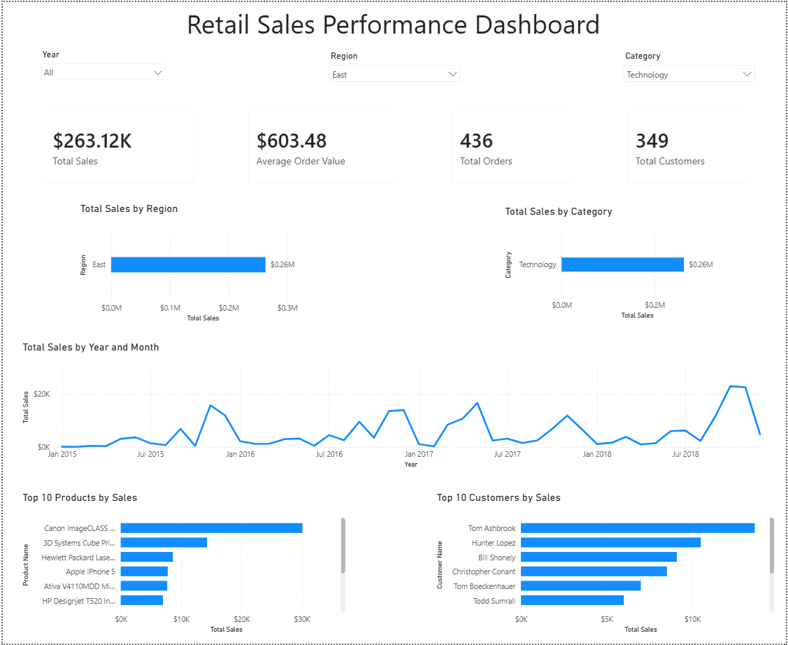

# Retail Sales Analytics

An end-to-end retail sales analysis using **Python, SQL, and Power BI** to examine sales performance, customer value, product performance, and regional trends.

## Project Overview

This project analyzes retail transaction data to identify key sales trends, top-performing products and regions, high-value customers, and overall business performance.

The project follows a complete analytics workflow:

**Raw Data → Python Cleaning → SQL Analysis → Power BI Dashboard**

## Tools Used

- Python
- Pandas
- SQL
- SQLite
- Power BI
- DAX

## Data Preparation

Python and Pandas were used to inspect, clean, and prepare the raw dataset before analysis.

Tasks included:

- Validating data types and column structure
- Identifying missing values
- Cleaning and standardizing fields
- Converting date columns to appropriate formats
- Preparing cleaned data for SQL analysis

## SQL Analysis

The cleaned dataset was loaded into SQLite and analyzed using SQL to answer business questions related to sales, customers, products, and regions.

SQL techniques used include:

- Filtering and sorting
- GROUP BY and aggregate functions (COUNT, SUM, AVG)
- HAVING

## Analysis

The analysis explores questions such as:

- Which regions generate the most sales?
- Which product categories perform best?
- How do sales change over time?
- Which products generate the most revenue?
- Who are the highest-value customers?
- What is the average order value?

## Power BI Dashboard

An interactive Power BI dashboard was created to summarize business performance and allow users to explore the data.

The dashboard includes:

- Total Sales
- Total Orders
- Total Customers
- Average Order Value
- Sales by Region
- Sales by Category
- Sales Trends
- Top Products
- Top Customers
- Interactive slicers and filters

DAX measures were used to calculate key performance indicators and support interactive analysis.

## Dashboard

## Project Workflow

1. Imported and inspected the raw dataset using Python
2. Cleaned and prepared the data with Pandas
3. Exported the cleaned dataset
4. Loaded the cleaned data into SQLite
5. Used SQL to answer business questions
6. Built DAX measures for key performance indicators
7. Created an interactive Power BI dashboard
8. Analyzed sales, product, customer, and regional performance
